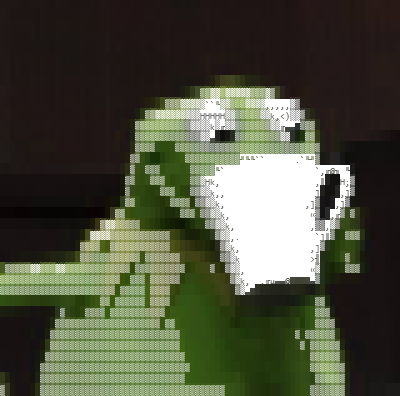

<p align="center">
  
</p>

<br>

## nopqpaws@github

---

```
OS: ......................... Linux / Windows
Role: ....................... Systems Administrator (full-time)
Languages: .................. Python, C, C++, Java, Bash, Go
Editor: ..................... Vim, JetBrains (PyCharm / IntelliJ), VS Code
Focus Areas: ................ Encryption, Cross‑Language Architecture, Security
Interests: .................. Building maintainable tools, performance tuning, clean documentation, and modular design
```

### Projects
---
**AES-GCM Encryptor** — AES-256-GCM encryption tool, implemented in [Python](https://github.com/nopqpaws/directory_encryptor), [Java](https://github.com/nopqpaws/DirectoryEncryptor), and [C](https://github.com/nopqpaws/directory_encryptor_c)

**nopsh** — Minimal POSIX-esque shell written in [C](https://github.com/nopqpaws/nopsh)

<p align="center">
  
  
</p>

---


